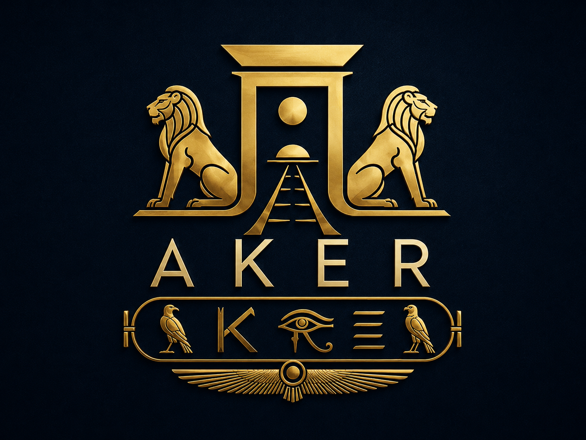

# Aker Build

[](https://github.com/Kemetra/Aker-Build/actions/workflows/aker-build.yml) [](LICENSE) [](https://github.com/sponsors/Kemetra)



<p align="center">
  <a href="https://github.com/sponsors/Kemetra">
    
  </a>
  <br />
  <sub>Fund benchmark coverage, framework support, documentation, and GitHub-native integrations.</sub>
</p>

Aker Build is a CLI-first SaaS Build Kernel for teams building multi-tenant SaaS systems with GitHub, specs, CI, and AI coding agents.

It helps teams answer:

- What is the current source truth?
- What is risky?
- What is blocked?
- What is the next safest task?
- What files may an AI agent touch?
- Is this PR ready to merge?

Aker Build is not a SaaS boilerplate. It does not generate a full app. It controls the build process around architecture, gates, queues, prompts, and verification.

## Status

Aker Build's MVP CLI chain and FORTIFY phases are implemented. The repository now builds and verifies a single-package `aker-build@0.1.0` tarball, provides an approval-protected release workflow, and reports which framework signature packs its scanner actually recognized. The first npm publication remains an explicit owner operation.

- Aker Build runs against its own repo through a report-only GitHub Action.
- A self-hostable, single-tenant report-only GitHub App runtime is implemented and tested locally; credentialed field verification remains an operator-run smoke step.
- Public npm availability is pending the owner-run first publish; the hosted dashboard/org view, blocking enforcement, auto-fix, auto-commit, and auto-merge remain deferred.

## Benchmark scorecard


Aker Build's detection quality is measured, not asserted. A labeled corpus of
synthetic multi-tenant failure cases (`benchmark/cases/`, 19 cases) runs through
the real `scan → gates` pipeline; precision/recall are computed per gate ×
confidence tier, and CI fails if they drop below `benchmark/thresholds.json`.

| Gate | Tier | Precision | Recall |
|---|---|---|---|
| TG-G3 Migration Safety | confirmed | 100% | 100% |
| TG-G3 Migration Safety | suspected | 100% | 100% |
| TG-G4 Tenant Isolation | confirmed | 100% | 100% |
| TG-G4 Tenant Isolation | suspected | 100% | 100% |
| TG-G5 Idempotency | suspected | 100% | 100% |

The `suspected` tier is the honest-uncertainty channel: it carries findings the
engine cannot yet structurally prove (they advise, never block). The corpus pins
multi-line tenant scoping, bare collection methods, model-first Mongoose calls,
and NestJS decorator guards so those behaviors cannot regress silently.

Project Map v2 records coverage evidence for Express, Fastify, Next.js App
Router, NestJS, Prisma, Mongoose, Django, SQLAlchemy, generic JavaScript DB
receivers, and raw SQL. Reports name the exact matched packs and capabilities—or
warn when none matched. These are deterministic signature recognizers, not an
AST or a claim of complete framework/repository coverage. The bounded five-line
tenant window and cross-file middleware remain deliberate heuristic limits.

Regenerate: `pnpm dlx tsx packages/eval/src/bin.ts` (writes `.aker-build/benchmark-report.{json,md}`).

## Quickstart

From a fresh checkout:

```bash
pnpm install
pwsh -File scripts/smoke-first-run.ps1
```

The smoke script copies `examples/multi-tenant-saas-basic` into a temporary git repo, runs the MVP CLI chain, creates a controlled local diff, and verifies the expected outputs.

Run the complete read-only advisory chain from source:

```bash
pnpm dlx tsx packages/cli/src/bin.ts check <repo> --out <out-dir>
```

To build and smoke the exact package that is ready for publication:

```bash
pnpm test:cli-package
node scripts/verify-cli-package.mjs --tarball-dir release
```

After the owner completes the first public release, the canonical activation path is:

```bash
npx aker-build check .
```

The standalone source commands remain available when a specific stage is needed:

```bash
pnpm dlx tsx packages/cli/src/bin.ts scan <repo> --out <out-dir>
pnpm dlx tsx packages/cli/src/bin.ts gates <repo> --out <out-dir>
pnpm dlx tsx packages/cli/src/bin.ts queue <repo> --out <out-dir>
pnpm dlx tsx packages/cli/src/bin.ts route <repo> --out <out-dir>
pnpm dlx tsx packages/cli/src/bin.ts prompt Q-001 --agent claude --out <out-dir>
pnpm dlx tsx packages/cli/src/bin.ts review-pr <repo> --local-diff --out <out-dir>
pnpm dlx tsx packages/cli/src/bin.ts report <repo> --out <out-dir>
```

## Core flow

```text
scan sources
→ build project map
→ run gates
→ derive queue
→ route next safest task
→ compile agent prompt
→ review result/PR
```

## MVP Commands

```bash
aker-build check [path]
aker-build scan [path]
aker-build map
aker-build gates [path]
aker-build queue [path]
aker-build route [path]
aker-build prompt <id> --agent claude|codex|generic
aker-build review-pr [path] --local-diff
aker-build review-pr <number>
aker-build report [path]
```

`check` composes `scan → gates → queue → route → report` and promotes its six-file output only after every stage succeeds. It does not generate prompts, review diffs, execute agents, or mutate the analyzed source.

## Support Aker Build

Aker Build is developed in public. Sponsorship helps fund benchmark expansion,
framework coverage, documentation, contributor support, and the work required to
turn the CLI kernel into a dependable GitHub-native product.

[**Sponsor Aker Build through GitHub Sponsors**](https://github.com/sponsors/Kemetra)

Sponsorship supports development; it does not buy a gate result, suppress a finding,
or change the project's published evidence and safety boundaries.

## Documentation

- First-run demo: `docs/demo/first-run.md`
- npm release runbook: `docs/release/npm.md`
- Post-foundation plan: `docs/roadmap/post-foundation-technical-plan.md`
- One-command distribution: `specs/017-one-command-distribution/spec.md`
- Framework coverage honesty: `specs/018-framework-coverage-honesty/spec.md`
- GitHub App server: `packages/github-app-server/README.md`
- Contributor guide: `CONTRIBUTING.md`
