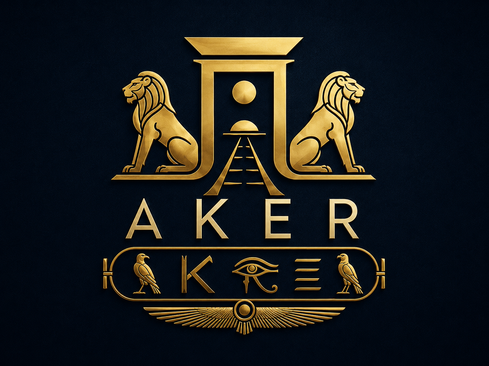

# Aker Build

[](https://github.com/Kemetra/Aker-Build/actions/workflows/aker-build.yml) [](LICENSE) [](https://github.com/sponsors/Kemetra)



<p align="center">
  <a href="https://github.com/sponsors/Kemetra">
    
  </a>
  <br />
  <sub>Fund benchmark coverage, framework support, documentation, and GitHub-native integrations.</sub>
</p>

Aker Build is a CLI-first SaaS Build Kernel for teams building multi-tenant SaaS systems with GitHub, specs, CI, and AI coding agents.

It helps teams answer:

- What is the current source truth?
- What is risky?
- What is blocked?
- What is the next safest task?
- What files may an AI agent touch?
- Is this PR ready to merge?

Aker Build is not a SaaS boilerplate. It does not generate a full app. It controls the build process around architecture, gates, queues, prompts, and verification.

## Status

Aker Build's MVP CLI chain and FORTIFY phases are implemented, and `aker-build@0.1.0` is
published on both [npm](https://www.npmjs.com/package/aker-build) and
[PyPI](https://pypi.org/project/aker-build/).

- Aker Build runs against its own repo through a report-only GitHub Action.
- A self-hostable, single-tenant report-only GitHub App runtime is implemented and tested locally; credentialed field verification remains an operator-run smoke step.
- An MCP server (`packages/mcp`) exposes the control plane to AI coding agents, read-only.
- The 0.1.0 npm release carries no provenance: it had to be published manually, because npm cannot bind a Trusted Publisher to a package that does not yet exist. Releases after Trusted Publishing is configured are provenanced — see `docs/release/npm.md`.
- The hosted dashboard/org view, blocking enforcement, auto-fix, auto-commit, and auto-merge remain deferred.

## Benchmark scorecard


Aker Build's detection quality is measured, not asserted — **including where it
fails**. A labeled corpus of synthetic multi-tenant failure cases
(`benchmark/cases/`, 19 cases) runs through the real `scan → gates` pipeline;
precision and recall are computed per gate × confidence tier, and CI fails if
they drop below `benchmark/thresholds.json`.

Every number below is reproducible with one command, against a corpus that ships
in this repository.

| Gate | Tier | Precision | Recall | TP | FP | FN |
|---|---|---|---|---|---|---|
| TG-G3 Migration Safety | confirmed | 100% | 100% | 1 | 0 | 0 |
| TG-G3 Migration Safety | suspected | 100% | 100% | 1 | 0 | 0 |
| TG-G4 Tenant Isolation | confirmed | 100% | 100% | 2 | 0 | 0 |
| TG-G4 Tenant Isolation | suspected | 100% | 100% | 4 | 0 | 0 |
| TG-G5 Idempotency | suspected | 100% | 100% | 2 | 0 | 0 |

Absolute counts are shown because percentages over small denominators mislead:
these rates rest on 10 true positives in total. Treat the corpus as a regression
harness that is still growing, not as a population estimate.

### What the corpus proves

A scorecard reading 100% is only meaningful if the corpus contains cases the
engine can fail. Four of these cases exist specifically to break it, and two of
them did:

- **Window bleed** (`window-bleed-false-negative`) — an unscoped query with a
  *neighbouring* statement's tenant token nearby. The detector's line window used
  to treat that token as scoping the query, a **false negative in the
  tenant-isolation gate**. Now the window is bounded by the query's own bracket
  depth, so it ends where the statement ends.
- **Model-first ORM calls** (`model-first-orm`) — Mongoose-style
  `User.findOne(`. Query detection gated on a database-handle allow-list
  (`db`, `prisma`, `knex`, …), so these were never seen at all. Now PascalCase
  receivers are recognised as models.
- **Multi-line scoping** (`multiline-tenant-scope`), **array methods**
  (`bare-array-method`) and **PascalCase non-models** (`pascal-case-non-model`)
  pin the opposite failures — a `where: { tenantId }` on the line below the call
  must still count as scoped; `users.find(...)` must still be ignored as an array
  method; and `Array.find(`, `Registry.find(`, `Cache.find(` must not be mistaken
  for ORM models just because they are capitalised.

Both fixes remain heuristics rather than parsing: window-based classifications
are emitted at `medium` confidence, which maps to the `suspected` tier — the
honest-uncertainty channel that advises and never blocks. Every finding carries
an evidence span (`file:line`) and a confidence tier.

Known remaining limitations, all deliberate: detection is regex-based, not
parsed, so ORM idioms outside the handle allow-list and the PascalCase convention
(e.g. a lowercase repository object with an unlisted name) go unseen; and the
statement window counts brackets inside string literals, so an unbalanced closer
in a SQL string could end a window early. The `coverage` field below is how the
first shows up honestly rather than silently; the second is why window-based
findings stay in `suspected`.

### Coverage

The scanner partitions the frameworks and data-access libraries it detects into
those its detectors understand and those they do not
(`project-map.coverage.covered` / `.uncovered`), so "no findings" always reads as
"no findings **in covered frameworks**". An unrecognised stack produces silence,
and silence is not safety.

Covered today: `express`, `prisma`, `mongoose`, `knex`, `sequelize`, `typeorm`,
`drizzle`. Detected but **not** understood — and reported as such: `nextjs`
(route handlers are `export async function GET`), `nestjs` (decorator-based),
`fastify` (hook-based), and UI frameworks. A scan of an `express` + `prisma` +
`next` repo reports `covered: [express, prisma]`, `uncovered: [nextjs]`.

Aker Build analyses TypeScript **application-layer** query code. For
database-layer RLS analysis it complements, rather than replaces, tools such as
[pgrls](https://github.com/pgrls/pgrls).

### Running it on real code

[`docs/evidence/2026-07-30-self-scan.md`](docs/evidence/2026-07-30-self-scan.md)
records what Aker Build reports when scanning its own repository — including the
unflattering part: **76% of its 34 findings are in its own test fixtures**, because
a detector's test suite is necessarily full of deliberately-vulnerable code. Each
finding is locally correct and most are not useful, which is why path scoping
matters in real adoption and why the roadmap gates blocking checks behind more
than benchmark precision.

Regenerate: `pnpm dlx tsx packages/eval/src/bin.ts` (writes `.aker-build/benchmark-report.{json,md}`).

## Quickstart

From a fresh checkout, on Linux or macOS:

```bash
pnpm install && bash scripts/smoke-first-run.sh
```

On Windows:

```bash
pnpm install; pwsh -File scripts/smoke-first-run.ps1
```

The smoke script copies `examples/multi-tenant-saas-basic` into a temporary git repo, runs the MVP CLI chain, creates a controlled local diff, and verifies the expected outputs. Both scripts assert the same things — that the reviewer returns `not_ready` for the controlled diff and that findings are actually summarized — so a detector going silent fails the smoke rather than passing it.

Run the complete read-only advisory chain from source:

```bash
pnpm dlx tsx packages/cli/src/bin.ts check <repo> --out <out-dir>
```

To build and smoke the exact package that is ready for publication:

```bash
pnpm test:cli-package
node scripts/verify-cli-package.mjs --tarball-dir release
```

After the owner completes the first public release, the canonical activation path is:

```bash
npx --package aker-build aker check .
```

> The package is `aker-build`; the command it installs is `aker`. Once installed
> globally (`npm i -g aker-build`), it is just `aker check .`.

Python-first toolchains can install the same CLI from PyPI:

```bash
pip install aker-build
aker check .
```

The wheel carries the compiled JavaScript engine and requires Node.js 22.13+ on your
PATH; it does not bundle a Node runtime. Both channels publish the same
`CLI_VERSION`, so `pip` and `npm` never diverge.

The standalone source commands remain available when a specific stage is needed:

```bash
pnpm dlx tsx packages/cli/src/bin.ts scan <repo> --out <out-dir>
pnpm dlx tsx packages/cli/src/bin.ts gates <repo> --out <out-dir>
pnpm dlx tsx packages/cli/src/bin.ts queue <repo> --out <out-dir>
pnpm dlx tsx packages/cli/src/bin.ts route <repo> --out <out-dir>
pnpm dlx tsx packages/cli/src/bin.ts prompt Q-001 --agent claude --out <out-dir>
pnpm dlx tsx packages/cli/src/bin.ts review-pr <repo> --local-diff --out <out-dir>
pnpm dlx tsx packages/cli/src/bin.ts report <repo> --out <out-dir>
```

## For AI coding agents (MCP)

Your agent asks Aker Build what to work on next, and what it is allowed to touch:

> *"What is my next safest task in this repository?"*

```json
{
  "item": { "id": "Q-002", "title": "Fix: API route without an auth guard", "confidence_tier": "confirmed" },
  "reason": ["highest score (0.86)", "status=ready", "tier=confirmed", "validation available"],
  "allowed_files": ["src/api.ts"],
  "forbidden_files": [],
  "evidence": [{ "path": "src/api.ts", "line": 1, "signal": "API route without an auth guard", "confidence": "high" }],
  "blocked": [{ "id": "Q-001", "reason": "insufficient evidence to scope a safe action (needs verification)" }],
  "freshness": { "refreshed": true, "age_ms": 0 }
}
```

Two things here are not available elsewhere. **The scope is derived**, not declared —
Aker Build computes the touchable file set from a scan of the architecture, rather
than asking you to write it down first. And **the task is ordered by agent-safety**,
not by technical debt: items it cannot scope safely are reported as blocked with a
reason, never guessed at.

Register the server with any MCP client:

```json
{
  "mcpServers": {
    "aker-build": {
      "command": "pnpm",
      "args": ["dlx", "tsx", "packages/mcp/src/bin.ts"]
    }
  }
}
```

Three read-only tools:

| Tool | Answers |
|---|---|
| `aker_build_next_task` | What should I work on, and what may I touch? |
| `aker_build_compile_prompt` | Give me the scoped prompt for `Q-002`. |
| `aker_build_deny_block` | Turn the forbidden set into a `settings.json` deny-block. |

The deny-block emitter closes the gap between advice and enforcement: a prompt
saying "do not touch these files" is text a model may ignore, while a Claude Code
deny rule is evaluated mechanically, deny-first. Aker Build computes the boundary;
the platform enforces it.

**Caveat, stated plainly:** deny rules govern the agent's own file tools. They do
not constrain arbitrary subprocesses an agent may spawn. This is stronger than a
prompt, not airtight.

All three tools are read-only. The server never modifies your repository, never
commits, never merges, and never executes an agent — consistent with Aker Build's
identity as a control plane rather than an actor.

## For AI coding agents (plugin)

Install the plugin and an agent needs to know one name — `aker-build`:

```text
/aker-build:next     one next-safest task + the files it may touch
/aker-build:check    run the read-only chain, findings advisory
/aker-build:review   Ready / Not Ready / Needs Verification
/aker-build:status   produced-artifact state, as recorded
/aker-build:prompt   the scoped prompt for one queue item
/aker-build:help     the full installed command map
```

The bundle is generated from `distribution/agent-command-surface.yaml` and
hash-verified per file, so the surface cannot drift from the CLI it projects: every
referenced verb is checked against `packages/cli/src/index.ts` at build time, every
command is asserted `read-only`, and the regenerated manifest must match the
reviewed baseline committed to Git. See [`distribution/`](distribution/README.md).

## Core flow

```text
scan sources
→ build project map
→ run gates
→ derive queue
→ route next safest task
→ compile agent prompt
→ review result/PR
```

## MVP Commands

```bash
aker check [path]
aker scan [path]
aker map
aker gates [path]
aker queue [path]
aker route [path]
aker prompt <id> --agent claude|codex|generic
aker review-pr [path] --local-diff
aker review-pr <number>
aker report [path]
```

`check` composes `scan → gates → queue → route → report` and promotes its six-file output only after every stage succeeds. It does not generate prompts, review diffs, execute agents, or mutate the analyzed source.

## Scope your scan first

**Path scoping is not optional on a real repository.** Detectors read code that
*looks like* a vulnerability, and a test suite for security-adjacent code is full of
deliberately-vulnerable examples on purpose. Scanning this repository unscoped
produces 38 findings, of which 30 are its own test fixtures — locally correct, and
almost all useless.

Create `aker-build.config.json` at the repo root before your first real run:

```json
{
  "version": 1,
  "paths": {
    "exclude": ["**/tests/**", "**/*.test.ts", "fixtures/**", "examples/**"]
  }
}
```

That removes every test-path finding. Add an entry for any other directory of
intentionally-unsafe code — this repository also excludes `benchmark/**`, its labeled
corpus of synthetic vulnerabilities, which takes its own scan from 21 findings to 8.

Verify the effect on your own repo rather than trusting a default — run
`aker check .`, add an exclude, run it again, and compare:

```bash
aker check . --out .aker-build
```

Pattern rules: `*` matches within one path segment and does not cross `/`; `**`
crosses segments; `dir/**` matches `dir` itself as well as everything beneath it.
`include` narrows the set first, `exclude` removes from it.

This repository's own [`aker-build.config.json`](aker-build.config.json) is a
working reference, and [`docs/evidence/2026-07-30-self-scan.md`](docs/evidence/2026-07-30-self-scan.md)
records the before-and-after numbers.

## Support Aker Build

Aker Build is developed in public. Sponsorship helps fund benchmark expansion,
framework coverage, documentation, contributor support, and the work required to
turn the CLI kernel into a dependable GitHub-native product.

[**Sponsor Aker Build through GitHub Sponsors**](https://github.com/sponsors/Kemetra)

Sponsorship supports development; it does not buy a gate result, suppress a finding,
or change the project's published evidence and safety boundaries.

## Documentation

- First-run demo: `docs/demo/first-run.md`
- npm release runbook: `docs/release/npm.md`
- Post-foundation plan: `docs/roadmap/post-foundation-technical-plan.md`
- Release integrity: `specs/016-release-integrity/spec.md`
- One-command distribution: `specs/017-one-command-distribution/spec.md`
- MCP server for AI agents: `packages/mcp/`
- GitHub App server: `packages/github-app-server/README.md`
- Contributor guide: `CONTRIBUTING.md`
